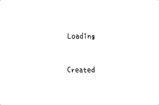
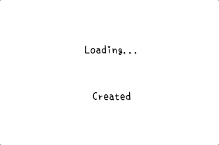

# KTLoadingLabel
[](http://cocoapods.org/pods/KTLoadingLabel)
[](http://cocoapods.org/pods/KTLoadingLabel)
[](http://cocoapods.org/pods/KTLoadingLabel)

## Example

To run the example project, clone the repo, and run `pod install` from the Example directory first.

## Requirements

- iOS 9.0+ / macOS 10.10+ / tvOS 9.0+ / watchOS 2.0+
- Xcode 8.3+
- Swift 3.1+

## Installation

KTLoadingLabel is available through [CocoaPods](http://cocoapods.org). To install
it, simply add the following line to your Podfile:

```ruby
pod 'KTLoadingLabel'
```

## Preview

- **Default:**



- **Reverse:**



## Usage

### Programmatically
```Swift
import KTLoadingLabel

let label = KTLoadingLabel.init(staticString: "Loading", animateString: "...")

// Start Animation of KTLoadingLabel
label.animate()

// Layout by setting constraints to view
/* Can also use frame/storyboard/xib to config */
label.centerXAnchor.constraint(equalTo: view.centerXAnchor).isActive = true
label.centerYAnchor.constraint(equalTo: view.centerYAnchor).isActive = true
label.leadingAnchor.constraint(greaterThanOrEqualTo: view.leadingAnchor, constant: 16).isActive = true
label.topAnchor.constraint(greaterThanOrEqualTo: view.topAnchor, constant: 8).isActive = true

// Layout by setting frame directly (Alternative)
label.frame = CGRect(x: 100, y: 100, width: 100, height: 100)

// You can also set the params of UILabel as normal
label.font = UIFont.systemFont(ofSize: 16)
label.textColor = .yellow
label.backgroundColor = .black
label.layer.cornerRadius = 8
// And more...

// End Animation of KTLoadKTLoadingLabel
label.stopAnimate()
```
### Storyboard / xib files

1. Simply drags UILabel into UIView.
2. Go to Identity Inspector, change the class to KTLoadingLabel.
3. Customize some params (e.g. staticText, animateText, repeats, etc...) in Attributes Inspector.
4. Setup autoResizing / autoConstraints.

## Parameters

- **StringType:** The possible patterns of text in label when it's not animating.
    - `fullString` — staticString + animateString. (Default)
    - `staticString` — staticString only.
    - `animateString` — animateString only.
- **AnimationType:** The possible animation styles of label when animating.
    - `defaults` — Linear, start from index 0. (i.e. 0, 1, 2, 3, 0, 1, ...).
    - `reverse` — Reverse order when meet the maximum index. (i.e. 0, 1, 2, 3, 2, 1, 0, 1, ...).
    
- **stringType `StringType`:** The pattern of text in label.
- **animationType `AnimationType`:** The animation style of label.
- **textSize `CGFloat`:** The text size of label. (Default: 16.0)

- **timerInterval `@IBInspectable Double`:** The speed of animation (per sec)
- **repeats `@IBInspectable Bool`:** Defines loops of animation. If repeats == false, animation will stop automatically after it go throughs 1 animation cycle, else will loop until stopAnimate() called.
- **autoAnimated `@IBInspectable Bool`:** `IB/Storyboard Only` If it set to true, will call animate() in awakeFormNib automatically.
- **staticText `@IBInspectable String`:** *Always override `text` attribute of UILabel* `Text of label which will always shown.
- **animateText `@IBInspectable String`:** Text of label will do animation.

## Custom Font

You can use any font as you want in the label.
If you want to use the font in the sample gif, you can  [**download here**](https://osdn.net/projects/setofont/releases/).
Or you can find this font file inside `/Example/KTLoadingLabel`.

## Author

Koki Tang

## License

KTLoadingLabel is available under the MIT license. See the LICENSE file for more info.
